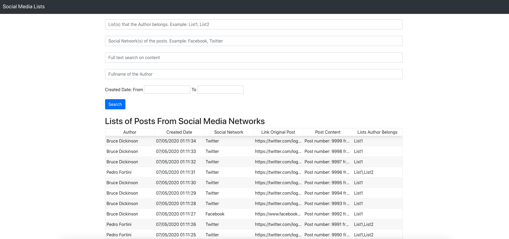
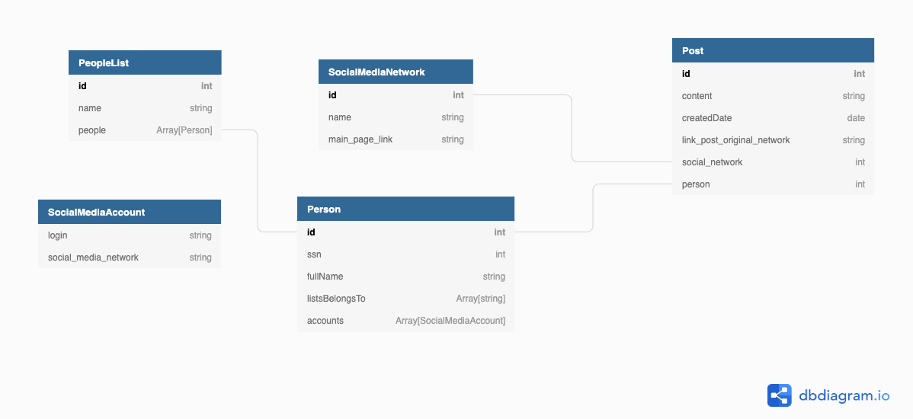

# Social Media Lists

Application responsible for displaying social media posts from lists of people and filter down the results.
In addition to searching for social media posts, the Backend API also exposes endpoints that allow the 
registration of new lists of people and new social networks.

This repository holds both Frontend (in the app folder) and Backend (in the src folder) of the application. The Backend
REST API was constructed using the **SpringBoot** framework, and the Frontend using the **React.js** library.  

## Getting started

### Dependencies

To run the application, install the lastest versions (except Java, which must be version 8) 
of the following applications:

- [Java 8](https://www.java.com/pt_BR/download/)
- [Maven](https://maven.apache.org/)
- [Node.js](https://nodejs.org/en/)
- [Yarn](https://yarnpkg.com/)

### Building

Maven is used to build the backend SpringBoot API, running the following command:

`mvn package`

To build the frontend ReactJS app, run the following command on the app folder of this repository:

`yarn install --check-files`

### Testing 

Both Unit and Integration tests were written for the SpringBoot backend API. Running integrated tests of SpringBoot 
applications requires loading the entire Spring context, which slows down the process of running these tests. 
Thus, separate ways of executing unit and integrated tests were created. 

Unit tests were made using JUnit, to run them use the command:

`mvn test`

The Integrated Tests were built using the TestRestTemplate abstraction, which allows to emulate the execution of REST 
requests to the API, allowing the creation of tests that validate all application layers. 
To run the unit and integrated tests use the command:

`mvn integration-test`

### Running 

To run the backend SpringBoot API, run:

 `mvn spring-boot:run`

The Backend API endpoints were generated and documented using [Swagger](https://swagger.io/). The swagger documentation
is located on `/src/main/resources/swagger.yaml`, use [Swagger Editor](https://editor.swagger.io/) to visualize it.

To run the React.js client, enter the app folder and run:

`yarn start`

You can acess the application in a web browser via the URL `http://localhost:3000`. Following Figure shows the Home 
page of the application. 

## Architecture

### Database Design

The application runs a embbeded MongoDB instance that runs on system startup, loading the data presented on 
`/src/main/resources/data.json`. The data is generated by the Python script presented on `/social-media-lists/createFakeDateFile.py`.
I decided to use MongoDB mainly because it is a NoSQL database solution, which facilitates the storage of denormalized data, 
and the sharing of that data if necessary. MongoDB can be deployed in clusters of machines, facilitating horizontal scaling with increasing demand.

The following figure is a Diagram show the Documents created and the relationships between them.

 
There are 4 collections mapped on MongoDB, social_media_networks, people, lists and posts, which contain documents 
of the types SocialMediaNetwork, Person, PeopleList and Post, respectively. The SocialMediaAccount entity shown in 
the figure above is stored embedded in documents of type Person. We have the following rules:

- PeopleList documents store people lists. They have a name, which must be unique, and a reference list (DBRef) 
for the people on the list.
- SocialMediaNetworks documents store social media data. They have a name and link to the main page of the social network.
- Person documents store people's data. They have: the person's social security number (ssn), the full name, a list 
with the names of the lists the person is on, and a list of documents embed with the person's accounts on various social networks.
 Each account has the person's login on the network and the name of the network, and this data pair must be unique.
- Post type documents store people's posts on social networks. They store: the content of the post, the date of creation, 
link to the original post on the social network and origin, a reference to the person who made the post, and another 
reference to the social network on which the post was made.

I decided to store the relationship between Person and PeopleList documents in a denormalized way, thus prioritizing the reading of data, 
making it easier to identify the lists that a person is included, but making it difficult to write data, 
since any update on a PeopleList document reflect updates on Person documents. I did this because the purpose of the system 
is to prioritize the speed of data reads.

### Backend API Design

The Backend API exposes 4 endpoints, namely:

- GET /posts => Gets data from all posts on database.
- POST /lists => Creates a List of People with Posts on Social Media Networks.
- GET /lists => Gets data from all Lists of People.
- POST /networks => Creates a Social Media Network.
- GET /networks => Gets data from all Social Media Networks.

## Usage

The web page is very simple, it initially displays all registered Posts, in a table, with the data paging done by 
the Backend. It is allowed to filter the Posts by: lists in which the author of the post is, full name of the author, 
social network(s) of the posts, content and date of creation. 
