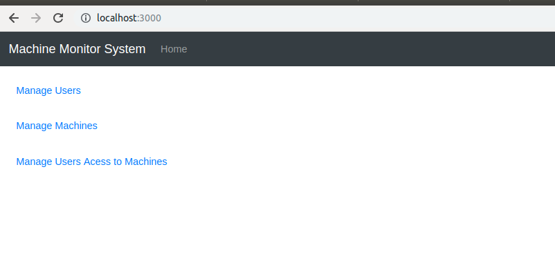
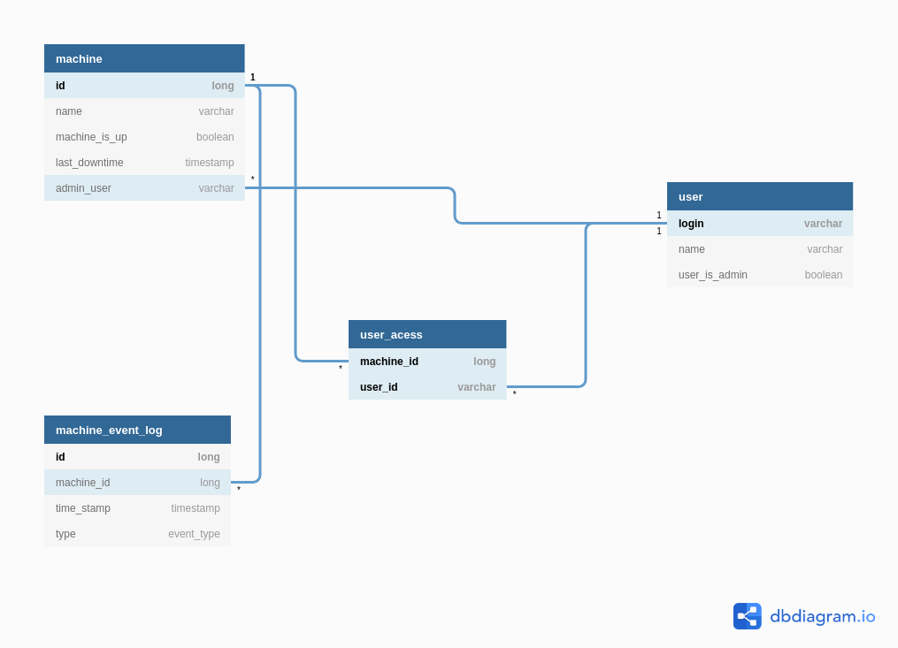

# Machine Monitor System

Application responsible for monitoring the usage of a group of computers, recording any downtime of the machines.
The system also manages the creation of machines and users, and granting users acess to the machines.

This repository holds both Frontend (in the app folder) and Backend (in the src folder) of the application. The Backend
REST API was constructed using the **SpringBoot** framework, and the Frontend using the **React.js** library.  

## Getting started

### Dependencies

To run the application, install the lastest versions (except Java, which must be version 8) 
of the following applications:

- [Java 8](https://www.java.com/pt_BR/download/)
- [Maven](https://maven.apache.org/)
- [Node.js](https://nodejs.org/en/)
- [Yarn](https://yarnpkg.com/)

### Building

Maven is used to build the backend SpringBoot API, running the following command:

`mvn package`

### Testing 

The SpringBoot API was tested using JUnit, to execute the tests run:

`mvn test`

### Running 

To run the backend SpringBoot API, run:

 `mvn spring-boot:run`

The Backend API endpoints were generated and documented using [Swagger](https://swagger.io/). The swagger documentation
is located on `/src/main/resources/swagger.yaml`, use [Swagger Editor](https://editor.swagger.io/) to visualize it.

To run the React.js client, enter the app folder and run:

`yarn add bootstrap@4.1.3 react-cookie@3.0.4 react-router-dom@4.3.1 reactstrap@6.5.0`

`yarn start`

You can acess the application in a web browser via the URL `http://localhost:3000`. Following Figure shows the Home 
page of the application. 

## Definitions

The following figure is the ER Diagram for the system.

The system manages two Entities: Machines and Users. Each machine have only one Admin User (One To Many relationship),
an User can be the Admin User of 0 or more machines. Every time the state of a machine (Running or Down) changes, this
event is recorded in the Machine Event Log Entity. The machine also keeps track of it's last downtime. A user can 
have acess to 0 or more machines, and machines have 1 or more Users who can acess them, this succumbs to a Many To Many 
relationship, maintained in the user_acess table.

## Usage

The application have three main menus:

- **Manage Users**: Displays the data of registered users. Allows the creation/editing of user data.
- **Manage Machines**: Displays the data of registered machines. Allows the creation/editing of machine data. Displays 
the users who have access to the machine, and the list of machine events.
- **Manage User Acess to Machines**: Allows the creation of users acess requests to machines.
